# YTB2BILI - YouTube 到 Bilibili 全自动转载系统

<div align="center">

[](https://golang.org/)
[](https://nextjs.org/)
[](https://www.docker.com/)
[](LICENSE)

**一个全自动化的视频搬运系统，从下载、字幕生成、AI翻译到定时发布的完整解决方案**

[功能特性](#-核心功能) • [快速开始](#-快速开始) • [配置说明](#️-配置说明) • [使用文档](#-使用指南) • [技术架构](#-技术架构)

</div>

---

## 🎯 项目简介

**YTB2BILI** 是一个专为内容创作者打造的智能视频搬运工具。通过整合 **yt-dlp**、**Whisper AI**、**DeepSeek/Gemini** 等先进技术，实现从 YouTube/TikTok 等平台到 Bilibili 的**零人工介入**全流程自动化。

### 🌟 核心亮点

- ✅ **完全自动化** - 从下载到发布，仅需提供视频链接
- 🧠 **AI 驱动** - 智能字幕生成、多语言翻译、元数据优化
- ⚡ **定时发布** - 智能调度避免频控，支持每小时自动上传
- 🔄 **失败重试** - 任务级精细化控制，支持单步骤重试
- 📊 **可视化管理** - 现代化 Web 管理界面，实时监控任务状态
- 🐳 **Docker 一键部署** - 开箱即用，支持 MySQL/PostgreSQL

---

## ✨ 核心功能

### 🎬 智能任务链处理引擎

系统采用**责任链模式**，将视频处理拆解为 7 个独立任务步骤：

```mermaid
graph LR
    A[下载视频] --> B[提取音频]
    B --> C[生成字幕]
    C --> D[翻译字幕]
    D --> E[下载封面]
    E --> F[生成元数据]
    F --> G[上传到B站]
    G --> H[上传字幕]
```



每个步骤支持独立执行、失败重试，状态实时可查。

#### 📥 视频下载 (`yt-dlp`)
- 支持 **YouTube、TikTok、Twitter** 等 1000+ 平台
- 自动选择最高清晰度（支持 4K/8K）
- 智能元数据提取（标题、描述、标签、播放量等）

#### 🎤 字幕生成 (`Whisper AI`)
- **本地离线生成**，无需依赖第三方 API
- 支持 90+ 种语言自动识别
- 生成带时间轴的 SRT/VTT 格式字幕
- 可选：通过 YouTube 自带字幕 URL 直接提取

#### 🌐 智能翻译 (多引擎)
- **DeepSeek API** - 高质量 AI 翻译，支持上下文理解
- **Google Gemini** - 多模态翻译，可分析视频画面
- **百度翻译** - 成本友好的备选方案
- 支持自定义翻译引擎（OpenAI 兼容接口）

#### 🤖 元数据生成 (AI)
- **标题优化** - 符合 B站 SEO，提升推荐率
- **简介生成** - 自动总结视频内容，添加关键词
- **标签提取** - 分析视频内容，生成相关话题标签
- **分区推荐** - 智能匹配 B站分区（生活/搞笑/游戏等）

#### 📤 Bilibili 上传
- **大文件分片上传** - 支持 GB 级视频稳定上传
- **腾讯云 COS 加速** - 可选 CDN 加速上传
- **自动投稿** - 配置版权、分区、封面等信息
- **CC 字幕追加** - 视频发布后自动上传多语言字幕

### 🚀 定时调度系统

- **Cron 定时任务** - 每 5 秒扫描待处理任务
- **智能队列管理** - 避免并发冲突，按优先级处理
- **自定义上传策略** - 每小时/每天定时发布，避免触发限流
- **重试机制** - 失败任务自动标记，支持手动/自动重试

### 💻 可视化管理后台

基于 **Next.js 15** 和 **TailwindCSS** 构建的现代化管理界面：

- **📊 仪表盘** - 任务统计、成功率图表、系统状态监控
- **📋 任务列表** - 实时查看所有视频的处理状态和进度
- **🔍 详情视图** - 查看每个任务步骤的执行日志和错误信息
- **🔐 B站登录** - 扫码登录，自动维护 Cookie 有效性
- **⚙️ 配置热更新** - 在线修改配置文件，无需重启服务
- **📁 文件浏览器** - 查看/下载/删除已下载的视频和字幕文件

---

## 🏗️ 技术架构

### 后端技术栈 (Golang)

| 组件 | 技术选型 | 用途说明 |
|------|---------|---------|
| **Web 框架** | Gin | 高性能 HTTP 路由和中间件 |
| **依赖注入** | Uber FX | 模块化依赖管理，提升可测试性 |
| **ORM** | GORM v2 | 数据库抽象层，支持 MySQL/PostgreSQL |
| **定时任务** | Robfig Cron v3 | 秒级精度的 Cron 调度器 |
| **日志系统** | Zap + Lumberjack | 结构化日志和自动轮转 |
| **文件存储** | 腾讯云 COS | 对象存储，支持大文件分片上传 |
| **认证鉴权** | JWT + Cookie | 双重认证机制 |

**核心模块**：
- `internal/chain_task` - 任务链处理引擎
- `internal/handler` - HTTP API 路由控制器
- `pkg/translator` - 多翻译引擎工厂模式实现
- `pkg/subtitle` - 字幕生成和格式转换
- `pkg/cos` - 腾讯云 COS 客户端封装

### 前端技术栈 (Next.js)

| 组件 | 技术选型 | 说明 |
|------|---------|------|
| **框架** | Next.js 15 (App Router) | React 服务端渲染框架 |
| **语言** | TypeScript 5 | 类型安全开发 |
| **UI 库** | TailwindCSS 3 | 原子化 CSS 框架 |
| **状态管理** | Zustand | 轻量级状态管理 |
| **HTTP 客户端** | Axios | 请求拦截和错误处理 |
| **图标** | Lucide React | 现代化图标库 |
| **二维码** | qrcode.react | B站登录二维码生成 |

### 外部服务集成

- **yt-dlp** - 开源视频下载工具
- **FFmpeg** - 音视频处理
- **Whisper** - OpenAI 语音识别模型
- **Bilibili SDK** - B站官方上传接口
- **DeepSeek/Gemini API** - AI 翻译和内容生成

---

## � 快速开始

### 方式一：Docker Compose 部署 (推荐 ⭐)

**最快 5 分钟完成部署！**

#### 1. 克隆项目
```bash
git clone https://github.com/difyz9/ytb2bili.git
cd ytb2bili
```

#### 2. 配置环境变量
复制配置文件模板并根据需要修改：
```bash
cp config.toml.example config.toml
```

**必须配置项**：
- `[database]` - 数据库连接信息（Docker 自动创建）
- `[DeepSeekTransConfig]` 或 `[GeminiConfig]` - 至少配置一个翻译 API
- `yt_dlp_path` - yt-dlp 可执行文件路径（Docker 已预装）

**可选配置项**：
- `[TenCosConfig]` - 腾讯云 COS 加速上传（推荐大文件上传）
- `[BilibiliConfig]` - 默认投稿配置（分区、版权声明等）

#### 3. 启动服务
```bash
docker-compose up -d
```

服务启动后：
- 🌐 访问 `http://localhost:8096` 进入管理后台
- 📊 数据库运行在 `localhost:3306`
- 💾 数据持久化在 Docker 卷 `ytb2bili_data`

#### 4. 查看日志
```bash
# 查看应用日志
docker-compose logs -f ytb2bili

# 查看数据库日志
docker-compose logs -f mysql
```

#### 5. 停止服务
```bash
docker-compose down
```

---

### 方式二：本地编译部署

#### 前置依赖

| 依赖 | 版本要求 | 安装方式 |
|------|---------|---------|
| **Go** | 1.24+ | [官网下载](https://golang.org/dl/) |
| **Node.js** | 18+ | [官网下载](https://nodejs.org/) 或 `nvm install 18` |
| **pnpm** | 最新 | `npm install -g pnpm` |
| **MySQL** | 8.0+ | Docker 或 [官方安装](https://dev.mysql.com/downloads/) |
| **FFmpeg** | 最新 | macOS: `brew install ffmpeg`<br>Linux: `apt install ffmpeg` |
| **yt-dlp** | 最新 | `pip3 install yt-dlp` 或 `brew install yt-dlp` |
| **Python** | 3.8+ | 系统自带或 `brew install python3` |

#### 1. 安装 Whisper (可选，用于字幕生成)
```bash
pip3 install openai-whisper
```

#### 2. 配置数据库
```sql
CREATE DATABASE ytb2bili CHARACTER SET utf8mb4 COLLATE utf8mb4_unicode_ci;
CREATE USER 'ytb2bili'@'localhost' IDENTIFIED BY 'your_password';
GRANT ALL PRIVILEGES ON ytb2bili.* TO 'ytb2bili'@'localhost';
FLUSH PRIVILEGES;
```

#### 3. 编译项目
```bash
# 一键构建（前端 + 后端）
make build

# 或分步构建
make build-web      # 仅构建前端
make build-api      # 仅构建后端
```

编译产物：
- 后端二进制：`bili-up-api-server`
- 前端资源：嵌入到二进制文件中

#### 4. 配置并运行
```bash
# 复制配置文件
cp config.toml.example config.toml

# 编辑配置（修改数据库连接和 API 密钥）
vim config.toml

# 启动服务
./bili-up-api-server
```

服务默认运行在 `http://localhost:8096`

#### 5. 开发模式（可选）
```bash
# 后端热重载
go run main.go

# 前端开发服务器
cd web
pnpm dev
# 访问 http://localhost:3000
```

---

## ⚙️ 配置说明

### 核心配置文件：`config.toml`

<details>
<summary><b>📋 基础配置</b></summary>

```toml
listen = ":8096"                    # HTTP 服务监听地址
environment = "development"         # 运行环境: development/production
debug = true                        # 是否开启调试日志
data_path = "./data"               # 数据存储根目录
yt_dlp_path = ""                   # yt-dlp 路径（空则使用系统 PATH）
```
</details>

<details>
<summary><b>🗄️ 数据库配置</b></summary>

```toml
[database]
  type = "mysql"                   # 数据库类型: mysql/postgres
  host = "localhost"
  port = 3306
  username = "ytb2bili"
  password = "your_password"
  database = "ytb2bili"
  ssl_mode = ""                    # PostgreSQL SSL 模式
  timezone = "Asia/Shanghai"
```

**支持的数据库**：
- ✅ MySQL 8.0+（推荐）
- ✅ PostgreSQL 15+
- ❌ SQLite（不支持并发写入）
</details>

<details>
<summary><b>🔐 认证配置</b></summary>

```toml
[auth]
  jwt_secret = "your-jwt-secret-key"        # JWT 密钥（建议 32 字符）
  jwt_expiration = 24                       # JWT 过期时间（小时）
  session_secret = "your-session-secret"    # Session 密钥

[api_auth]
  app_id = "ytb2bili_extension"             # 应用 ID
  app_secret = "your-app-secret"            # 应用密钥
  cookies_decrypt_key = "your-decrypt-key"  # Cookies 解密密钥（32 字符）
```

**生成安全密钥**：
```bash
# macOS/Linux
openssl rand -base64 32
```
</details>

<details>
<summary><b>🌐 翻译服务配置</b></summary>

#### DeepSeek 翻译（推荐 🌟）
```toml
[DeepSeekTransConfig]
  enabled = true
  api_key = "sk-xxxxxxxxxxxx"               # API Key
  models = "deepseek-chat"                  # 模型名称
  endpoint = "https://api.deepseek.com"
  timeout = 60                              # 超时时间（秒）
  max_tokens = 4000                         # 最大输出 Token
```
- 💰 **成本低**：¥1/百万 Token
- 🎯 **质量高**：上下文理解能力强
- 🔗 [获取 API Key](https://platform.deepseek.com/)

#### Google Gemini（多模态）
```toml
[GeminiConfig]
  enabled = true
  api_key = "AIzaSyxxxxxxxxxx"              # Google AI API Key
  model = "gemini-2.0-flash-exp"            # 模型: flash-exp/pro
  timeout = 120
  max_tokens = 8000
  use_for_metadata = true                   # 是否用于元数据生成
  analyze_video = true                      # 是否分析视频画面
  video_sample_frames = 10                  # 视频采样帧数
```
- 🎬 **多模态**：可直接分析视频内容
- 🆓 **免费额度**：每天 1500 次请求
- 🔗 [获取 API Key](https://aistudio.google.com/app/apikey)

#### 百度翻译（备选）
```toml
[BaiduTransConfig]
  enabled = false
  app_id = "your-baidu-app-id"
  api_key = "your-baidu-api-key"
  endpoint = "https://fanyi-api.baidu.com/api/trans/vip/translate"
```
</details>

<details>
<summary><b>☁️ 腾讯云 COS 配置（可选）</b></summary>

```toml
[TenCosConfig]
  Enabled = true
  CosBucketURL = "https://your-bucket.cos.ap-guangzhou.myqcloud.com"
  CosSecretId = "AKIDxxxxxxxx"
  CosSecretKey = "xxxxxxxx"
  CosRegion = "ap-guangzhou"
  CosBucket = "your-bucket-name"
  SubAppId = "125xxxxxx"
```

**优势**：
- ⚡ 上传速度提升 3-5 倍
- 📦 支持超大文件（>4GB）
- 💾 自动分片续传

**费用**：
- 存储：¥0.118/GB/月
- 流量：¥0.5/GB（国内）
</details>

<details>
<summary><b>📺 Bilibili 投稿配置</b></summary>

```toml
[BilibiliConfig]
  copyright = 2                           # 1=自制, 2=转载
  source = "YouTube"                      # 转载来源
  no_reprint = 1                          # 0=允许转载, 1=禁止转载
  tid = 138                               # 分区 ID (138=搞笑, 122=日常)
  
  # 标题和描述模板
  use_original_title = false              # 是否使用原标题
  use_original_desc = false               # 是否使用原描述
  custom_title_template = "{ai_title}【中文字幕】"
  custom_desc_template = """
【AI 翻译】
{ai_desc}

【原视频】
{original_desc}
"""
  
  # 其他配置
  dynamic = "分享一个有趣的视频！"          # 动态文本
  open_elec = 1                           # 是否开启充电面板
```

**常用分区 ID**：
| 分区 | ID | 分区 | ID |
|------|---|------|---|
| 生活-日常 | 122 | 娱乐-搞笑 | 138 |
| 知识-科普 | 201 | 游戏-单机 | 17 |
| 美食 | 211 | 动画-MAD | 24 |
</details>

### 配置验证

启动服务前，可以使用以下命令验证配置：
```bash
# 检查配置文件语法
./bili-up-api-server --check-config

# 测试数据库连接
./bili-up-api-server --test-db

# 测试翻译 API
./bili-up-api-server --test-translation
```

---

## 📖 使用指南

### 第一步：登录 Bilibili 账号

1. 访问管理后台 `http://localhost:8096`
2. 点击"账号管理" → "扫码登录"
3. 使用 **Bilibili APP** 扫描二维码
4. 登录成功后，系统自动保存 Cookie 和 Token

> 💡 **提示**：Cookie 有效期约 30 天，过期后需重新登录

### 第二步：添加视频任务

#### 方式一：通过 Web 界面

1. 进入"视频管理"页面
2. 点击"新建任务"
3. 粘贴 YouTube/TikTok 视频链接
4. （可选）设置自定义标题、描述、分区
5. 点击"创建"，系统自动开始处理

#### 方式二：通过 API

```bash
curl -X POST http://localhost:8096/api/videos \
  -H "Content-Type: application/json" \
  -d '{
    "url": "https://www.youtube.com/watch?v=dQw4w9WgXcQ",
    "custom_title": "【搬运】Rick Astley - Never Gonna Give You Up",
    "auto_upload": true
  }'
```

**支持的视频源**：
- ✅ YouTube (`youtube.com`, `youtu.be`)
- ✅ TikTok (`tiktok.com`, `douyin.com`)
- ✅ Twitter (`twitter.com`, `x.com`)
- ✅ Instagram (`instagram.com`)
- ✅ 1000+ 其他平台（[完整列表](https://github.com/yt-dlp/yt-dlp/blob/master/supportedsites.md)）

### 第三步：监控任务进度

系统会自动执行以下步骤：

```
1. 📥 下载视频           [约 1-5 分钟]
   └─ 自动选择最高清晰度

2. 🎤 提取音频           [约 10-30 秒]
   └─ 转换为 WAV 格式供 Whisper 处理

3. 📝 生成字幕           [约 1-10 分钟，取决于视频长度]
   └─ Whisper AI 自动识别语音

4. 🌐 翻译字幕           [约 30 秒-2 分钟]
   └─ DeepSeek/Gemini 智能翻译

5. 📷 下载封面           [约 5-10 秒]
   └─ 提取高清缩略图

6. 🤖 生成元数据         [约 20-60 秒]
   └─ AI 分析生成标题、简介、标签

7. 📤 上传到 Bilibili    [约 5-30 分钟，取决于视频大小]
   └─ 自动投稿，获取 BV 号

8. 📝 上传字幕           [约 10-30 秒]
   └─ 添加 CC 字幕到已发布视频
```

**查看实时进度**：
- 🌐 Web 界面显示百分比进度条
- 📊 每个步骤的状态：待处理 / 处理中 / 完成 / 失败
- 📜 详细日志可在"任务详情"页面查看

### 第四步：处理失败任务

如果某个步骤失败，可以单独重试：

1. 进入"任务详情"页面
2. 找到失败的步骤（红色标记）
3. 点击"重试"按钮
4. 系统仅重新执行该步骤，无需从头开始

**常见失败原因**：
- ❌ **下载失败** - 视频已删除/地区限制 → 使用代理或更换视频源
- ❌ **字幕生成失败** - 视频无语音内容 → 跳过此步骤或手动上传字幕
- ❌ **翻译失败** - API 额度用尽 → 更换翻译引擎或充值
- ❌ **上传失败** - 网络超时 → 检查网络或启用 COS 加速

### 第五步：定时发布（可选）

系统支持延迟发布，避免频繁投稿触发限流：

1. 在配置文件中设置上传策略：
```toml
[UploadSchedule]
  enabled = true
  interval = "1h"              # 每小时上传一个视频
  daily_limit = 10             # 每天最多上传 10 个视频
  upload_time = "08:00-22:00"  # 仅在此时间段内上传
```

2. 视频处理完成后，状态变为"待上传"
3. 调度器自动在合适的时间上传

### 高级功能

#### 批量导入视频
```bash
# 从文件读取视频列表
cat video_list.txt | while read url; do
  curl -X POST http://localhost:8096/api/videos -d "{\"url\":\"$url\"}"
done
```

#### 自定义字幕
如果 Whisper 生成的字幕不准确，可以手动替换：
1. 下载 `.srt` 字幕文件
2. 使用 Aegisub 等工具编辑
3. 在"任务详情"页面上传自定义字幕
4. 点击"重新翻译"

#### Webhook 通知
在 `config.toml` 中配置 Webhook：
```toml
[Webhook]
  enabled = true
  url = "https://your-webhook-url.com/notify"
  events = ["upload_success", "upload_failed"]
```

系统会在关键事件时发送 POST 请求：
```json
{
  "event": "upload_success",
  "video_id": "abc123",
  "bv_id": "BV1xx411c7mD",
  "title": "视频标题",
  "timestamp": "2026-01-25T10:30:00Z"
}
```

---

## 📁 项目结构

```
ytb2bili/
├── 📄 main.go                          # 应用入口，Uber FX 依赖注入配置
├── 📄 config.toml                      # 主配置文件
├── 📄 Makefile                         # 构建脚本（一键编译前后端）
├── 🐳 docker-compose.yml               # Docker 编排文件
├── 🐳 Dockerfile                       # 容器构建文件
│
├── 📂 internal/                        # 内部业务逻辑（不对外暴露）
│   ├── 📂 chain_task/                  # ⛓️ 任务链处理引擎
│   │   ├── chain_task_handler.go       #    任务调度器（每 5 秒扫描待处理任务）
│   │   ├── upload_scheduler.go         #    上传调度器（定时上传）
│   │   ├── 📂 handlers/                #    具体任务处理器
│   │   │   ├── down_load_video.go      #      1️⃣ 下载视频（yt-dlp）
│   │   │   ├── extract_audio.go        #      2️⃣ 提取音频（FFmpeg）
│   │   │   ├── generate_subtitles.go   #      3️⃣ 生成字幕（Whisper）
│   │   │   ├── translate_subtitle.go   #      4️⃣ 翻译字幕（AI）
│   │   │   ├── download_img_handler.go #      5️⃣ 下载封面
│   │   │   ├── generate_metadata.go    #      6️⃣ 生成元数据（AI）
│   │   │   ├── upload_to_bilibili.go   #      7️⃣ 上传视频
│   │   │   └── upload_subtitle_to_bilibili.go  8️⃣ 上传字幕
│   │   └── 📂 manager/                 #    任务链状态管理
│   │       ├── chain.go                #      任务链定义
│   │       └── state.go                #      状态机实现
│   │
│   ├── 📂 core/                        # 核心服务层
│   │   ├── app_server.go               #    HTTP 服务器配置（Gin）
│   │   ├── 📂 models/                  #    数据库模型（GORM）
│   │   │   ├── tb_video.go            #      视频表（保存下载的视频信息）
│   │   │   ├── tb_task_step.go        #      任务步骤表（记录每个步骤的状态）
│   │   │   ├── tb_user.go             #      用户表（B站账号信息）
│   │   │   └── tb_bili_account.go     #      B站账号详情（Cookie、Token）
│   │   └── 📂 services/                #    业务逻辑服务
│   │       ├── saved_video_service.go  #      视频管理服务
│   │       └── task_step_service.go    #      任务步骤服务
│   │
│   ├── 📂 handler/                     # HTTP API 路由控制器
│   │   ├── video_handler.go            #    视频管理 API（增删改查）
│   │   ├── upload_handler.go           #    上传相关 API
│   │   ├── subtitle_handler.go         #    字幕管理 API
│   │   ├── auth_handler.go             #    认证 API（登录、注册）
│   │   ├── accounts_handler.go         #    B站账号管理 API（扫码登录）
│   │   ├── config_handler.go           #    配置热更新 API
│   │   ├── cron_handler.go             #    定时任务管理 API
│   │   └── analytics_handler.go        #    数据分析 API
│   │
│   ├── 📂 middleware/                  # HTTP 中间件
│   │   └── firebase_auth.go            #    Firebase 认证中间件
│   │
│   ├── 📂 storage/                     # 存储接口
│   │   ├── interfaces.go               #    存储接口定义
│   │   └── login_store.go              #    登录信息存储
│   │
│   └── 📂 web/                         # 静态资源（嵌入到二进制）
│       └── static.go                   #    Next.js 构建产物嵌入
│
├── 📂 pkg/                             # 公共工具包（可复用）
│   ├── 📂 analytics/                   # 数据分析客户端
│   │   ├── client.go                   #    分析事件上报
│   │   └── middleware.go               #    分析中间件
│   │
│   ├── 📂 auth/                        # 认证鉴权
│   │   ├── jwt.go                      #    JWT Token 生成/验证
│   │   ├── middleware.go               #    认证中间件
│   │   └── decrypt_middleware.go       #    Cookie 解密中间件
│   │
│   ├── 📂 cos/                         # 腾讯云 COS 客户端
│   │   ├── cos_client.go               #    COS 上传/下载封装
│   │   └── download_utils.go           #    下载工具函数
│   │
│   ├── 📂 translator/                  # 翻译引擎（工厂模式）
│   │   ├── interface.go                #    翻译器接口定义
│   │   ├── factory.go                  #    翻译器工厂
│   │   ├── manager.go                  #    翻译管理器（多引擎切换）
│   │   ├── deepseek_translator.go      #    DeepSeek 翻译实现
│   │   ├── baidu_translator.go         #    百度翻译实现
│   │   └── gemini_translator.go        #    Gemini 翻译实现
│   │
│   ├── 📂 subtitle/                    # 字幕处理
│   │   ├── ytdlp_subtitle.go           #    yt-dlp 字幕提取
│   │   └── README.md                   #    字幕格式说明
│   │
│   ├── 📂 services/                    # 第三方服务集成
│   │   ├── bilibili_account_service.go #    B站账号服务（登录、上传）
│   │   └── subtitle_service.go         #    字幕服务
│   │
│   ├── 📂 store/                       # 数据存储
│   │   ├── database.go                 #    数据库连接池
│   │   ├── migrate.go                  #    数据库迁移
│   │   ├── cache_dict.go               #    缓存字典
│   │   └── 📂 model/                   #    通用数据模型
│   │
│   ├── 📂 utils/                       # 通用工具函数
│   │   ├── crypto.go                   #    加密解密工具
│   │   ├── ffmpeg_utils.go             #    FFmpeg 工具封装
│   │   ├── file_utils.go               #    文件操作工具
│   │   ├── youtube_utils.go            #    YouTube 工具函数
│   │   ├── ytdlp_manager.go            #    yt-dlp 管理器
│   │   └── subtitle_validator.go       #    字幕验证器
│   │
│   └── 📂 logger/                      # 日志系统
│       └── logger.go                   #    Zap 日志配置
│
├── 📂 web/                             # Next.js 前端项目
│   ├── 📄 package.json                 #    前端依赖配置
│   ├── 📄 next.config.js               #    Next.js 配置
│   ├── 📄 tailwind.config.ts           #    TailwindCSS 配置
│   ├── 📄 tsconfig.json                #    TypeScript 配置
│   │
│   ├── 📂 src/
│   │   ├── 📂 app/                     #    App Router 页面
│   │   │   ├── page.tsx                #      首页（仪表盘）
│   │   │   ├── videos/                 #      视频管理页面
│   │   │   ├── accounts/               #      账号管理页面
│   │   │   └── settings/               #      设置页面
│   │   │
│   │   ├── 📂 components/              #    React 组件
│   │   │   ├── VideoCard.tsx           #      视频卡片组件
│   │   │   ├── TaskProgress.tsx        #      任务进度条
│   │   │   ├── QRCodeLogin.tsx         #      扫码登录组件
│   │   │   └── FileManager.tsx         #      文件管理器
│   │   │
│   │   ├── 📂 services/                #    API 服务层
│   │   │   ├── api.ts                  #      Axios 实例配置
│   │   │   ├── videoService.ts         #      视频 API
│   │   │   └── accountService.ts       #      账号 API
│   │   │
│   │   └── 📂 types/                   #    TypeScript 类型定义
│   │       ├── video.ts
│   │       └── account.ts
│   │
│   └── 📂 output/                      #    构建产物（静态文件）
│       ├── index.html
│       ├── _next/
│       └── static/
│
├── 📂 data/                            # 数据存储目录（运行时生成）
│   ├── videos/                         #    下载的视频文件
│   ├── subtitles/                      #    生成的字幕文件
│   ├── thumbnails/                     #    视频封面图片
│   └── temp/                           #    临时文件
│
├── 📂 cookies/                         # B站登录 Cookie 存储
└── 📂 logs/                            # 日志文件（按日期轮转）
```

### 关键文件说明

| 文件 | 作用 | 重要度 |
|------|------|--------|
| `main.go` | 应用启动入口，依赖注入配置 | ⭐⭐⭐⭐⭐ |
| `config.toml` | 全局配置文件 | ⭐⭐⭐⭐⭐ |
| `chain_task_handler.go` | 任务调度核心逻辑 | ⭐⭐⭐⭐⭐ |
| `upload_to_bilibili.go` | B站上传核心实现 | ⭐⭐⭐⭐ |
| `translator/factory.go` | 翻译引擎工厂模式 | ⭐⭐⭐⭐ |
| `Makefile` | 一键构建脚本 | ⭐⭐⭐ |

---

## 🔧 API 文档

### 基础信息
- **Base URL**: `http://localhost:8096/api`
- **认证方式**: JWT Token (Header: `Authorization: Bearer <token>`)
- **响应格式**: JSON

### 视频管理 API

<details>
<summary><b>获取视频列表</b></summary>

```http
GET /api/videos?page=1&limit=20
```

**查询参数**：
- `page`: 页码（默认 1）
- `limit`: 每页数量（默认 20）

**响应示例**：
```json
{
  "code": 0,
  "message": "success",
  "data": {
    "videos": [
      {
        "id": 1,
        "video_id": "dQw4w9WgXcQ",
        "title": "Rick Astley - Never Gonna Give You Up",
        "source_url": "https://youtube.com/watch?v=dQw4w9WgXcQ",
        "status": "002",
        "bv_id": "BV1xx411c7mD",
        "progress": 75,
        "created_at": "2026-01-25T10:00:00Z"
      }
    ],
    "total": 100,
    "page": 1,
    "limit": 20
  }
}
```
</details>

<details>
<summary><b>创建视频任务</b></summary>

```http
POST /api/videos
Content-Type: application/json

{
  "url": "https://www.youtube.com/watch?v=dQw4w9WgXcQ",
  "custom_title": "【搬运】Rick Astley",
  "auto_upload": true
}
```

**请求参数**：
- `url` (必填): 视频 URL
- `custom_title` (可选): 自定义标题
- `auto_upload` (可选): 是否自动上传（默认 true）

**响应**：
```json
{
  "code": 0,
  "message": "任务创建成功",
  "data": {
    "video_id": "dQw4w9WgXcQ",
    "task_id": "abc123"
  }
}
```
</details>

<details>
<summary><b>重试任务步骤</b></summary>

```http
POST /api/videos/:id/steps/:stepName/retry
```

**路径参数**：
- `id`: 视频 ID
- `stepName`: 步骤名称（如 `generate_subtitles`）

**响应**：
```json
{
  "code": 0,
  "message": "步骤重试已提交"
}
```
</details>

### B站账号 API

<details>
<summary><b>生成登录二维码</b></summary>

```http
GET /api/accounts/qrcode
```

**响应**：
```json
{
  "code": 0,
  "data": {
    "qrcode_key": "abc123456",
    "qrcode_url": "data:image/png;base64,iVBORw0KGgo..."
  }
}
```
</details>

<details>
<summary><b>检查登录状态</b></summary>

```http
GET /api/accounts/qrcode/poll?qrcode_key=abc123456
```

**响应**：
```json
{
  "code": 0,
  "data": {
    "status": "success",
    "user_info": {
      "uid": 123456,
      "username": "测试用户",
      "avatar": "https://..."
    }
  }
}
```
</details>

---

## 🐛 常见问题

### 1. 视频下载失败

**问题**：提示"无法下载视频"或"403 Forbidden"

**解决方案**：
```bash
# 更新 yt-dlp 到最新版本
pip3 install -U yt-dlp

# 如果是地区限制，配置代理
[ProxyConfig]
  use_proxy = true
  proxy_host = "http://127.0.0.1:7890"
```

### 2. 字幕生成失败

**问题**：Whisper 报错或字幕为空

**解决方案**：
- 确认安装了 Whisper：`pip3 install openai-whisper`
- 检查视频是否有语音内容
- 尝试使用其他 Whisper 模型：
  ```toml
  whisper_model = "medium"  # 默认 base，可选 tiny/small/medium/large
  ```

### 3. 翻译 API 超时

**问题**：DeepSeek/Gemini API 请求超时

**解决方案**：
```toml
# 增加超时时间
[DeepSeekTransConfig]
  timeout = 120  # 从 60 秒增加到 120 秒

# 或切换到其他引擎
[BaiduTransConfig]
  enabled = true
```

### 4. 上传到 B站失败

**问题**：上传时报错或进度卡住

**解决方案**：
- **检查登录状态**：Cookie 可能已过期，重新扫码登录
- **启用 COS 加速**：大文件（>1GB）建议使用腾讯云 COS
- **检查网络**：确保服务器能访问 B站 API
- **查看详细日志**：
  ```bash
  tail -f logs/app.log | grep "upload"
  ```

### 5. Docker 容器无法启动

**问题**：`docker-compose up` 报错

**解决方案**：
```bash
# 检查端口占用
lsof -i :8096
lsof -i :3306

# 清理旧容器
docker-compose down -v
docker-compose up -d --force-recreate

# 查看日志
docker-compose logs -f
```

### 6. 前端页面无法访问

**问题**：访问 `http://localhost:8096` 显示 404

**解决方案**：
```bash
# 确认前端已编译
make build-web

# 检查前端资源是否嵌入
ls -lh internal/web/bili-up-web/

# 重新构建
make clean && make build
```

---

## 🚀 性能优化建议

### 1. 数据库优化
```sql
-- 为常用查询添加索引
CREATE INDEX idx_video_status ON tb_video(status);
CREATE INDEX idx_task_step_status ON tb_task_step(status);
CREATE INDEX idx_video_created_at ON tb_video(created_at DESC);
```

### 2. 启用 COS 加速
大文件上传速度提升 3-5 倍：
```toml
[TenCosConfig]
  Enabled = true
  # ... 填写 COS 配置
```

### 3. 调整并发数
```toml
# 增加定时任务扫描频率
cron_interval = "*/3 * * * * *"  # 3 秒扫描一次

# 同时处理多个任务
max_concurrent_tasks = 3
```

### 4. 使用更快的翻译引擎
```toml
# Gemini Flash 速度更快
[GeminiConfig]
  model = "gemini-2.0-flash-exp"  # 比 pro 快 5 倍
```

---

## 🤝 贡献指南

欢迎贡献代码、报告 Bug 或提出新功能建议！

### 开发流程

1. **Fork 本仓库**
   ```bash
   git clone https://github.com/your-username/ytb2bili.git
   cd ytb2bili
   ```

2. **创建功能分支**
   ```bash
   git checkout -b feature/amazing-feature
   ```

3. **提交更改**
   ```bash
   git add .
   git commit -m "feat: 添加令人惊叹的功能"
   ```
   
   提交信息规范（参考 [Conventional Commits](https://www.conventionalcommits.org/)）：
   - `feat:` 新功能
   - `fix:` Bug 修复
   - `docs:` 文档更新
   - `style:` 代码格式调整
   - `refactor:` 代码重构
   - `test:` 测试相关
   - `chore:` 构建工具或依赖更新

4. **推送到远程**
   ```bash
   git push origin feature/amazing-feature
   ```

5. **提交 Pull Request**
   - 在 GitHub 上创建 PR
   - 详细描述改动内容和动机
   - 等待 Code Review

### 代码规范

- **Go 代码**：遵循 [Effective Go](https://golang.org/doc/effective_go)
- **TypeScript 代码**：使用 ESLint 和 Prettier
- **提交前检查**：
  ```bash
  # Go 代码格式化
  go fmt ./...
  
  # 前端代码检查
  cd web && npm run lint
  ```

---

## 📄 许可证

本项目采用 [MIT License](LICENSE) 开源协议。

```
MIT License

Copyright (c) 2026 YTB2BILI Contributors

Permission is hereby granted, free of charge, to any person obtaining a copy
of this software and associated documentation files (the "Software"), to deal
in the Software without restriction, including without limitation the rights
to use, copy, modify, merge, publish, distribute, sublicense, and/or sell
copies of the Software...
```

---

## 🙏 致谢

本项目使用了以下优秀的开源项目：

- [yt-dlp](https://github.com/yt-dlp/yt-dlp) - 视频下载核心
- [OpenAI Whisper](https://github.com/openai/whisper) - 语音识别
- [bilibili-go-sdk](https://github.com/difyz9/bilibili-go-sdk) - B站 API 封装
- [Gin](https://github.com/gin-gonic/gin) - Web 框架
- [Next.js](https://nextjs.org/) - 前端框架
- [GORM](https://gorm.io/) - ORM 框架

特别感谢所有贡献者和使用者！

---

## 📞 联系方式

- **GitHub Issues**: [提交问题](https://github.com/difyz9/ytb2bili/issues)
- **讨论区**: [GitHub Discussions](https://github.com/difyz9/ytb2bili/discussions)
- **💬 QQ交流群**: 773066052 (技术交流和问题讨论)
- **📧 微信联系**: 扫描下方二维码添加微信
<div align="center">


<br/>
<em>📱 扫码添加微信 - 技术交流与支持</em>
</div> 
---

<div align="center">

**如果这个项目对你有帮助，请给一个 ⭐Star！**

Made with ❤️ by [difyz9](https://github.com/difyz9)

</div>


